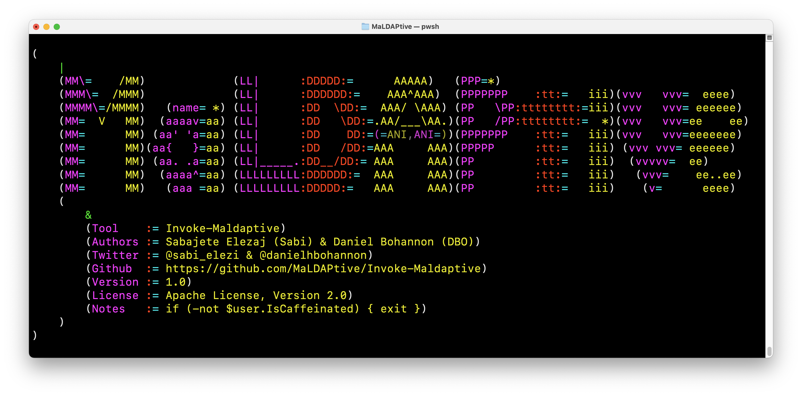
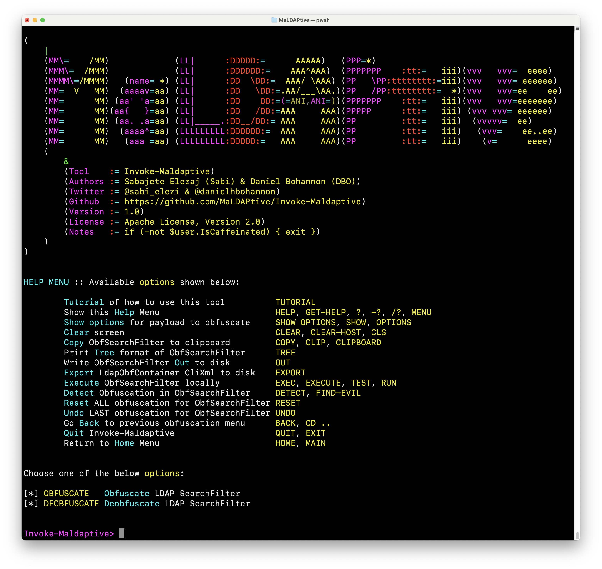
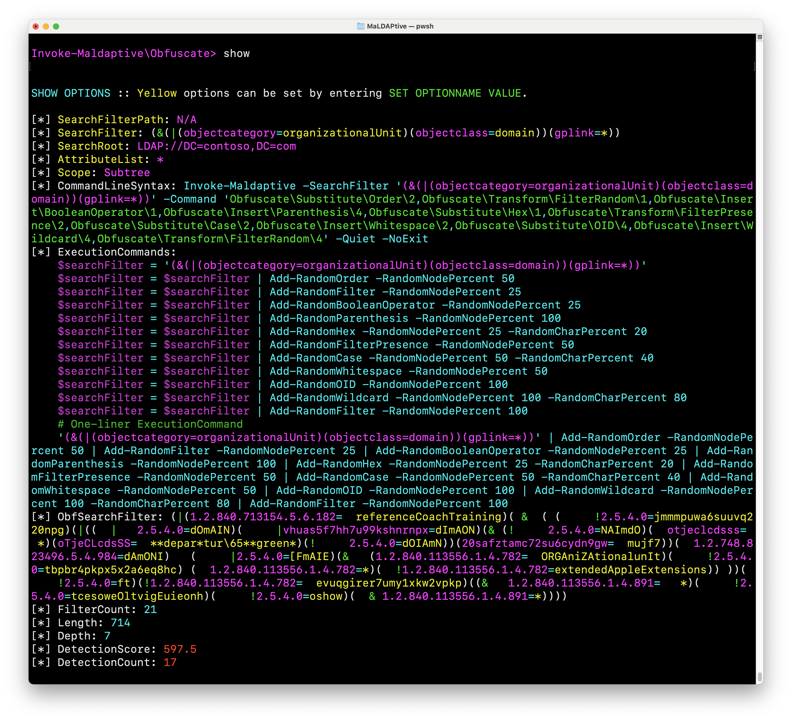
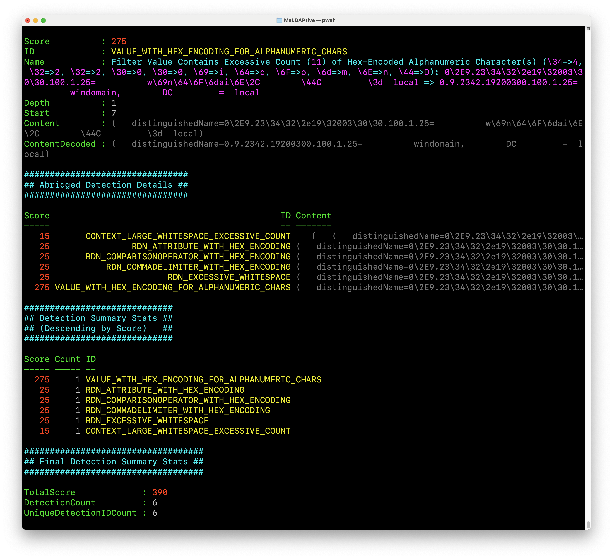
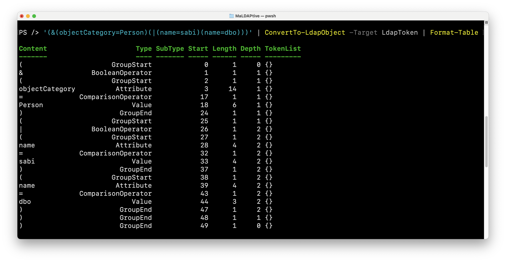
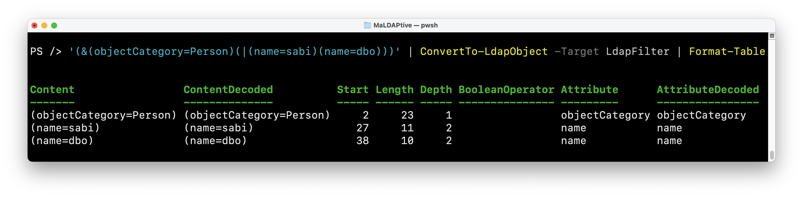

# MaLDAPtive

**Released At:** <a href="https://blackhat.com/us-24/briefings/schedule/index.html#maldaptive-diving-deep-into-ldap-obfuscation-deobfuscation--detection-38458">Black Hat USA 2024</a> (2024-08-07) & <a href="https://defcon.org/html/defcon-32/dc-32-speakers.html">DEF CON 32</a> (2024-08-11)
**Authors:** <a href="https://twitter.com/sabi_elezi">Sabajete Elezaj (Sabi)</a> & <a href="https://twitter.com/danielhbohannon">Daniel Bohannon (DBO)</a>

## Introduction

MaLDAPtive is a framework for LDAP SearchFilter parsing, obfuscation, deobfuscation and detection.

Its foundation is a 100% custom-built C# LDAP parser that handles tokenization and syntax tree parsing along with numerous custom properties that enable accurate and efficient obfuscation, deobfuscation and detection of LDAP SearchFilters. The rest of the project is a PowerShell wrapper designed for maximum flexibility, randomization and pipeline capabilities for seamlessly connecting all desired functions in a single command.

## Release Details

As defenders, from the very beginning of this research we wanted to release the information and framework in a responsible manner and decided on a two-stage release. This decision was nobody's but our own and we made this two-stage approach crystal clear in our CFP submissions.

**Therefore, in the initial release of this research we are publishing all code EXCEPT the obfuscation module.** After at least 4 months we will then release the obfuscation module along with a Part II of this research (exact date TBD based on pending CFP submission). 

Our intention is to give defenders a multi-month head start on setting up required LDAP SearchRequest telemetry and implementing the full detection ruleset that we published with this research.

| Module Name          | Release Date |
|----------------------|--------------|
| LDAP Parser          | 2024-08-07   |
| Deobfuscation Module | 2024-08-07   |
| Detection Module     | 2024-08-07   |
| Detection Ruleset    | 2024-08-07   |
| Telemetry Module     | 2024-08-07   |
| Obfuscation Corpus   | 2024-08-07   |
| Obfuscation Module   | <span style="color:red">Intentionally delayed release |

## Installation

>```PowerShell
>Import-Module ./MaLDAPtive.psd1
>```

## Required Packages

>```bash
>PowerShell 7.1
>.NET 6.0 (LTS)
>```

## Usage

Interactive mode is a colorful, menu-driven experience found in the `Invoke-Maldaptive` function (which also supports non-interactive capabilities via its own built-in CLI). It is designed to promote exploration of all available functions with colored highlighting applied to amplify the important details returned from each function. There is also some special animated ASCII art in this function, so we recommend giving it a whirl first.



Menu exploration supports full regex and basic wildcards, with special automated menu traversal options defined by `**`, `***` and `****` commands. You can always type `HELP` or `TUTORIAL` for more guidance.

At any point the full details of each layer of obfuscation or deobfuscation can be viewed, copied or fully exported out of the interactive menu. MaLDAPtive also has full CLI support displayed in the same menu, so interactive mode can be used to "create obfuscation recipes" that can easily be exported into simple 1-liner commands.



The entire detection module is built into the interactive menu as well, at all times displaying the rule count and total detection score. Running `FIND-EVIL` will give a full summary of the detection report evaluated in sheer milliseconds against the current obfuscated LDAP SearchFilter.



Finally, we published a corpus of 1,337 obfuscated LDAP SearchFilters to be used as examples for detection engineers. These obfuscated samples can also be readily used to test the detection module via the following command: `Get-Content ./Corpus/ObfuscatedSearchFilters.txt | Get-Random | Find-Evil -Summarize | Show-EvilSummary`

## Parser Usage

The `ConvertTo-LdapObject` function is the simplest way to access the various parsing methods defined in `./CSharp/LdapParser.cs`. There are five (5) levels of parsing available and defined via the function's `-Target` input parameter.

The following two commands demonstrate the most directly useful parsing levels:

`'(&(objectCategory=Person)(|(name=sabi)(name=dbo)))' | ConvertTo-LdapObject -Target LdapToken | Format-Table`

The underlying C# method can also be called directly: `[Maldaptive.LdapParser]::Tokenize('(&(objectCategory=Person)(|(name=sabi)(name=dbo)))') | Format-Table`



`'(&(objectCategory=Person)(|(name=sabi)(name=dbo)))' | ConvertTo-LdapObject -Target LdapFilter | Format-Table`

The underlying C# method can also be called directly: `[Maldaptive.LdapParser]::ToFilter('(&(objectCategory=Person)(|(name=sabi)(name=dbo)))',$true) | Format-Table`



## Invocation Module

To simplify the execution of an LDAP SearchRequest we created the `Invoke-LdapQuery` function (with a convenient alias of `ILQ`). Additionally, the `Out-LdapObject` function pretty-prints any input LDAP SearchFilter which is helpful when debugging large SearchFilters since each token type is color-coded for clarity.

## Telemetry Module

Gathering LDAP telemetry for client- and server-side log sources is a non-trivial task in a lab environment without closed source EDR agents. Therefore, we packaged our telemetry module for installation, configuration, querying and normalization for client- and server-side telemetry. In our lab we installed this module on a Domain Controller to simplify local testing. **Do not run this module on any production systems. We do not assume responsibility for any damages that might occur in relation to this module.** All telemetry functions are located in `./Helpers/LdapEventLog.psm1`.